# Data Model

## Phase 0 To Phase 3D Entities

Phase 0 created the foundation models required for users, organisations, memberships, permissions, idempotency and audit logs. Phase 1A completes their lifecycle and permission behavior. Phase 1B adds company and distributor onboarding details plus KYC document metadata for approval queues. Phase 2A adds company-owned brand and master product catalogue records with variant and product document metadata. Phase 2B adds distributor-owned warehouse, batch and append-only inventory movement foundations. Phase 2C adds distributor-owned offers linked to approved catalogue variants and sellable inventory scope. Phase 2D adds public marketplace discovery as a derived read model over approved catalogue, approved offers, serviceable pincodes and inventory movement balances. Phase 2E adds operational offer status transitions and inventory ageing reports over the same persisted records. Phase 3A adds farmer-owned profile, address and cart records with backend-generated price and availability snapshots. Phase 3B adds parent product checkouts, distributor-split child product orders, order items, batch-level reservation rows and product order status history. Phase 3C adds mock payment intent records and append-only payment event history linked to farmer-owned product checkouts. Phase 3D adds cancellation status transitions and append-only reservation release movements for eligible unpaid or payment-failed checkouts/orders.

### Identity

- `User`: platform account with optional email and phone. Uses UUID public identifiers and UTC timestamps.
- `UserProfile`: display and locale preferences for one user.
- `FarmerProfile`: farmer-owned profile details linked one-to-one to a `User`.
- `FarmerAddress`: farmer-owned delivery address records linked to one `FarmerProfile`.

### Organisations and Access

- `Organisation`: business or internal organisation such as Vardhnam, company, distributor or service provider.
- `Organisation.reviewedAt`, `reviewedByUserId`, `reviewReason`: approval decision metadata for company, distributor and service-provider verification flows.
- `OrganisationMembership`: joins users to organisations with one platform role and a status.
- `Permission`: machine-readable permission code.
- `RolePermission`: maps platform roles to permissions.

Duplicate memberships are blocked by `userId`, `organisationId` and `role`.

### Company and Distributor Onboarding

- `CompanyProfile`: company-specific legal, brand and primary contact details for one `COMPANY` organisation.
- `DistributorProfile`: distributor-specific code, operating address, primary contact, fulfilment capability and serviceable pincode details for one `DISTRIBUTOR` organisation.
- `KycDocument`: metadata for onboarding documents submitted against a company or distributor organisation. Phase 1B stores metadata and lifecycle status only; file upload and private document storage are future work.

Each company or distributor organisation can have at most one matching onboarding profile and multiple KYC document metadata records.

### Catalogue Foundation

- `Brand`: company-owned brand metadata. Brands use `CatalogueStatus` and must be submitted before approval or rejection.
- `MasterProduct`: company-owned master product metadata linked to one approved brand before product approval.
- `ProductVariant`: product pack-size metadata including variant name, pack size, pack unit, optional SKU and optional MRP stored in paise.
- `ProductDocument`: metadata for product labels, registrations, safety sheets, images, test reports or other catalogue documents. Phase 2A stores metadata only; file upload and private document storage are future work.

Each `COMPANY` organisation may own many brands and master products. Each master product belongs to one brand, may have many variants and may have many product document metadata records.

### Inventory Foundation

- `Warehouse`: distributor-owned physical stock location with code, address, pincode, contact metadata and warehouse status.
- `InventoryBatch`: distributor and warehouse-specific batch metadata linked to one approved master product and one active product variant.
- `InventoryMovement`: append-only stock movement record with movement type, quantity delta, balance after movement, actor metadata and required reason.

Each `DISTRIBUTOR` organisation may own many warehouses, inventory batches and inventory movements. Each batch belongs to one warehouse and one product variant. On-hand stock is read from the latest movement balance, and sellable quantity is zero when a batch is blocked or expired.

### Distributor Offer Foundation

- `DistributorOffer`: distributor-owned sellable offer metadata linked to one approved master product, one active variant, one warehouse and optionally one batch.
- `DistributorOffer.sellingPricePaise`: distributor selling price stored as an integer amount in paise.
- `DistributorOffer.serviceablePincodes`: pincode list used for future farmer-visible serviceability.
- `DistributorOffer.fulfilmentMode`: commercial fulfilment mode metadata only; through Phase 2E the platform does not execute delivery.
- `DistributorOffer.status`: offer lifecycle status for draft, submitted, approved, rejected, paused or archived records. Phase 2E uses `PAUSED` for temporary farmer-visibility removal and `ARCHIVED` for non-deleted retirement.

Offer availability is not stored as a mutable field. It is derived by the backend from active, unexpired inventory batches and latest append-only movement balances. Phase 3A cart items may reference approved offers and snapshot availability, but they do not create reservations, checkouts, payments, deliveries, finance records, settlements or Tally records. Phase 3B checkout creates `RESERVED_FOR_ORDER` inventory movements, so availability automatically excludes reserved stock through the latest movement balance. Phase 3D cancellation creates `RELEASED_FROM_ORDER` movements to restore reserved stock without deleting the original reservation trail.

### Marketplace Discovery Read Model

Phase 2D does not add new persistent database tables. Public marketplace product listings are derived at request time from:

- `MasterProduct.status = APPROVED`
- `Brand.status = APPROVED`
- active product variants
- active distributor organisations
- active warehouses
- `DistributorOffer.status = APPROVED`
- requested pincode present in `DistributorOffer.serviceablePincodes`
- active, unexpired `InventoryBatch` records
- the latest `InventoryMovement.balanceAfter` per eligible batch

The read model groups eligible offers by master product and returns seller, warehouse, optional batch, fulfilment, price and backend-derived availability metadata. It excludes private product document fields such as `fileName` and `storageKey` from farmer-facing product detail responses.

### Inventory Ageing Read Model

Phase 2E does not add persistent reporting tables. Inventory ageing, low-stock and expiring-batch reports are derived from:

- `InventoryBatch.status`
- `InventoryBatch.createdAt`
- `InventoryBatch.expiryDate`
- `Warehouse` and distributor ownership metadata
- latest `InventoryMovement.balanceAfter`

Report rows include on-hand quantity, sellable quantity, batch age, days until expiry and alert flags. Blocked and expired batches are visible in the combined ageing report but are not counted as sellable low-stock rows.

### Farmer Profile, Address And Cart Foundation

- `FarmerProfile`: profile data for the authenticated farmer user, including full name, preferred locale, optional village/district/state, primary pincode and crop interests.
- `FarmerAddress`: reusable farmer address records with pincode, recipient, phone, address lines and default-address metadata.
- `Cart`: one active cart per farmer profile in Phase 3A, with optional delivery address and serviceable pincode context.
- `CartItem`: cart item records linked to an approved distributor offer and its source distributor, product, variant and warehouse.

`CartItem` stores backend-generated snapshots for price in paise, derived availability, pincode, product name, variant name, seller name, warehouse name, fulfilment mode and delivery SLA. These snapshots are for cart review only. They do not reserve inventory, create a checkout, create product orders, create invoices or write financial ledger entries.

Cart validation reads from the same approved catalogue, approved offer, serviceable pincode and active unexpired inventory movement foundations used by marketplace discovery. Changing the cart pincode while items exist is rejected so stale serviceability assumptions do not survive into checkout.

### Product Checkout And Order Foundation

- `ProductCheckout`: parent checkout record created from one authenticated farmer cart. It stores farmer profile, source cart, delivery address, serviceable pincode, checkout status, subtotal in paise, item count and child order count.
- `ProductOrder`: child product order record for one distributor seller. It stores order type, seller, farmer, delivery address, serviceable pincode, seller snapshot, delivery address snapshot, subtotal in paise, item count and current status.
- `ProductOrderItem`: item snapshot copied from current backend offer/catalogue data at checkout time. It stores product, variant, warehouse, offer, quantity, unit price in paise, line total in paise and fulfilment metadata.
- `ProductOrderItemReservation`: batch-level reservation row linking a product order item to the append-only inventory movement that reserved stock.
- `ProductOrderStatusHistory`: append-only status transition history for each product order with actor, role, reason, request ID and timestamp.
- `ProductInvoice`: one invoice snapshot per child product order. It stores invoice number, status, seller legal/display/GSTIN snapshots, farmer name snapshot, delivery address snapshot, line item snapshot, reservation batch references and backend-calculated subtotal/tax/total amounts in paise.
- `ProductDispatch`: one dispatch readiness snapshot per child product order. It stores dispatch number, linked invoice, seller, farmer, pincode, delivery address, warehouse/item snapshots, ready-for-pickup reason, ready-by actor and ready timestamp.
- `ProductDeliveryAssignment`: one delivery assignment snapshot per child product order and dispatch. It stores assigned delivery partner user, delivery status, dispatch/invoice/seller snapshots, pickup and item snapshots, hashed delivery OTP metadata, failed attempt count, assignment/start/completion actor metadata and proof note.

`ProductCheckout.status` starts as `PENDING_PAYMENT` in Phase 3B. Child `ProductOrder` records are created as `PENDING_PAYMENT` and transition to `INVENTORY_RESERVED` after reservation movements are written. Phase 3C may move the checkout through `PAYMENT_PROCESSING`, `PAYMENT_FAILED` or `PAID` from backend mock payment actions. Phase 3D may move eligible `PENDING_PAYMENT` or `PAYMENT_FAILED` checkouts and eligible `PENDING_PAYMENT`, `INVENTORY_RESERVED` or `PAYMENT_FAILED` child orders to `CANCELLED`. Phase 3B through Phase 3D do not create real payment captures, invoices, delivery tasks, finance ledger entries, settlement records, refund records or Tally records.

### Mock Payment Foundation

- `PaymentIntent`: mock-only payment attempt linked to one farmer-owned `ProductCheckout` and `FarmerProfile`. It stores provider mode, provider reference, status, amount in paise, currency and optional failure metadata.
- `PaymentEvent`: append-only mock payment event history for intent creation, confirmation start, success and failure. It stores event type, resulting payment status, provider reference, payload metadata, actor, request ID and timestamp.

`PaymentIntent.providerMode` is `MOCK` through Phase 3C. `PaymentIntent.status` can be `PENDING`, `PROCESSING`, `SUCCEEDED` or `FAILED`. Payment intent creation sets the checkout and child orders to `PAYMENT_PROCESSING`. Mock confirmation with `SUCCESS` sets the payment intent to `SUCCEEDED`, checkout to `PAID`, and child product orders to `CONFIRMED`. Mock confirmation with `FAILURE` sets the payment intent to `FAILED`, checkout to `PAYMENT_FAILED`, and child product orders to `PAYMENT_FAILED`.

Phase 3C payment records are not a financial ledger and do not create distributor payable, marketplace commission, fulfilment fee, delivery fee, promoter commission, tax, refund, adjustment, settlement or Tally records. Inventory reservations remain in place after payment failure until a Phase 3D farmer cancellation creates positive `RELEASED_FROM_ORDER` movements.

### Distributor Fulfilment Foundation

Phase 4A and 4B use existing `ProductOrder` and `ProductOrderStatusHistory` tables. Distributor fulfilment list/detail APIs read child product orders where `sellerOrganisationId` is the distributor seller of record. Accept and reject actions move eligible `CONFIRMED` orders to `DISTRIBUTOR_ACCEPTED` or `DISTRIBUTOR_REJECTED` and append status history plus audit records. Picking and packing actions move `DISTRIBUTOR_ACCEPTED` orders to `READY_TO_PACK`, then `READY_TO_PACK` orders to `PACKED`.

Phase 4C adds `ProductInvoice`. Invoice generation is allowed for packed product orders and creates exactly one invoice per child order using `ProductInvoice.productOrderId` uniqueness. The invoice snapshots seller, buyer, delivery and line-item data as it existed at generation time, records `taxPaise = 0` until approved GST breakup rules exist, and audits `PRODUCT_INVOICE_GENERATED`. Phase 4C adds no packing-detail, dispatch, delivery, refund, settlement, finance ledger or Tally tables.

Phase 4D adds `ProductDispatch`. Dispatch readiness is allowed only for packed product orders with a generated invoice and creates exactly one dispatch record per child order using `ProductDispatch.productOrderId` uniqueness. The dispatch snapshots invoice number, seller, delivery address, warehouse quantities and reserved item batches, then moves the child order to `READY_FOR_PICKUP`. Phase 4D adds no delivery assignment, delivery OTP, notification, refund, settlement, finance ledger or Tally tables.

Phase 4E adds `ProductDeliveryAssignment`. Assignment is allowed only for ready-for-pickup product orders with a ready dispatch and creates exactly one assignment per child order and dispatch using `ProductDeliveryAssignment.productOrderId` and `dispatchId` uniqueness. The assignment snapshots dispatch, invoice, seller, delivery address, pickup and item data, stores the delivery OTP as `otpHash` plus `otpSalt`, records expiry and failed attempt count, and moves through `ASSIGNED`, `OUT_FOR_DELIVERY` and `DELIVERED` in the current slice. The local/mock assignment response may include a transient `mockOtpCode`, but the raw OTP is not stored. Phase 4E adds no real SMS/WhatsApp notification, geotagged proof capture, delivery payout, commission, settlement, refund, finance ledger or Tally tables.

### Cancellation And Reservation Release Foundation

Phase 3D does not add new tables. It adds the `RELEASED_FROM_ORDER` inventory movement type and uses existing checkout, order, reservation, status history, audit and idempotency records.

Cancellation APIs use `IdempotencyRecord` scoped to the authenticated farmer user plus checkout or order ID. A cancellation stores status transitions in `ProductOrderStatusHistory`, updates the current checkout/order status to `CANCELLED`, and writes audit records. Each released reservation is represented by a new `InventoryMovement` with a positive `quantityDelta`, `referenceType = ProductOrderCancellation` and `referenceId = ProductOrder.id`. `ProductOrderItemReservation` rows continue to point at the original reservation movement; release movement audit payloads carry the original reservation movement ID for traceability.

Checkout uses `IdempotencyRecord` scoped to the authenticated farmer user. Duplicate checkout requests with the same idempotency key and same request hash return the stored checkout response. Mock payment and cancellation workflows also use idempotency records and return stored responses for matching completed requests.

### Audit and Idempotency

- `AuditLog`: append-only event history for security-sensitive and business-critical actions.
- `IdempotencyRecord`: checkout, mock payment and future webhook idempotency foundation.

## Ownership

Users own profile records and farmer profile records. Farmer profiles own farmer addresses, carts, product checkouts and product orders. Organisations own memberships and business resources. Company organisations own catalogue records. Distributor organisations own warehouses, batches, inventory movements, distributor offers and child product orders where they are seller of record. Audit logs reference the actor and organisation when known, but must survive even if optional relationships are absent.

## Transaction Boundaries

The following operations should use database transactions:

- User creation with profile creation and audit entry
- Organisation creation with membership creation and audit entry
- Membership creation with duplicate checks and audit entry
- Company profile, distributor profile and KYC document changes with audit entries
- Brand, master product, product variant and product document metadata changes with audit entries
- Warehouse, batch and inventory movement changes with audit entries
- Distributor offer create, update, submit and review decisions with audit entries
- Distributor offer pause, reactivate and archive status transitions with audit entries
- Marketplace discovery reads do not create records and do not require database transactions
- Inventory ageing reports are read-only and do not require database transactions
- Farmer profile and address writes with audit entries
- Cart context and cart item mutations with audit entries
- Checkout creation with child product orders, order status history, batch-level inventory reservation movements, cart clearing, audit entries and idempotency completion
- Mock payment intent creation with checkout/order status transitions, payment event history, audit entries and idempotency completion
- Mock payment confirmation with payment intent, checkout and child order status transitions, payment event history, audit entries and idempotency completion
- Distributor fulfilment accept/reject with child order status transition, status history and audit entry
- Distributor fulfilment picking/packing with child order status transition, status history and audit entry
- Distributor invoice generation with product invoice snapshot and audit entry
- Distributor dispatch readiness with product dispatch snapshot, child order status transition, status history and audit entries
- Delivery assignment with product delivery assignment snapshot and audit entry
- Delivery start/completion with assignment status update, child order status transition, status history, OTP attempt audit where applicable and delivery audit entries
- Future real payment capture and ledger posting

## Deletion Policy

Phase 0 avoids physical deletion for audit logs and idempotency records. Phase 2B inventory movements are append-only and have no update or delete API. Phase 2C offers are status-managed records; Phase 2E offer retirement uses `ARCHIVED` rather than physical deletion. Phase 2D discovery and Phase 2E reports add no deletion behavior because they are read-only. Phase 3A cart item removal may physically delete non-financial cart rows while preserving cart mutation audit history. Phase 3B checkout clears cart item rows only after order item snapshots and reservation rows are created. Phase 3D cancellation does not delete reservation rows or reservation movements; it appends release movements and status history. Product checkout, product order, product order item, reservation, status history, payment intent, payment event, inventory movement, product invoice, product dispatch and product delivery assignment rows must not be physically deleted through application workflows. Future financial, settlement and audit data must not be physically deleted.

## Mermaid ER Diagram

```mermaid
erDiagram
  USER ||--o| USER_PROFILE : has
  USER ||--o{ ORGANISATION_MEMBERSHIP : belongs_to
  USER ||--o| FARMER_PROFILE : has
  FARMER_PROFILE ||--o{ FARMER_ADDRESS : has
  FARMER_PROFILE ||--o| CART : owns
  FARMER_PROFILE ||--o{ PRODUCT_CHECKOUT : creates
  FARMER_PROFILE ||--o{ PRODUCT_ORDER : buys
  FARMER_PROFILE ||--o{ PAYMENT_INTENT : pays_with
  FARMER_PROFILE ||--o{ PRODUCT_INVOICE : receives
  FARMER_PROFILE ||--o{ PRODUCT_DISPATCH : dispatches
  FARMER_PROFILE ||--o{ PRODUCT_DELIVERY_ASSIGNMENT : receives
  FARMER_ADDRESS ||--o{ CART : selected_for
  FARMER_ADDRESS ||--o{ PRODUCT_CHECKOUT : selected_for
  FARMER_ADDRESS ||--o{ PRODUCT_ORDER : delivers_to
  CART ||--o{ CART_ITEM : contains
  CART ||--o{ PRODUCT_CHECKOUT : checked_out_as
  USER ||--o{ ORGANISATION : reviews
  USER ||--o{ BRAND : reviews
  USER ||--o{ MASTER_PRODUCT : reviews
  USER ||--o{ DISTRIBUTOR_OFFER : reviews
  USER ||--o{ INVENTORY_MOVEMENT : records
  USER ||--o{ PRODUCT_DELIVERY_ASSIGNMENT : delivers
  ORGANISATION ||--o{ ORGANISATION_MEMBERSHIP : has
  ORGANISATION ||--o| COMPANY_PROFILE : has
  ORGANISATION ||--o| DISTRIBUTOR_PROFILE : has
  ORGANISATION ||--o{ KYC_DOCUMENT : submits
  ORGANISATION ||--o{ BRAND : owns
  ORGANISATION ||--o{ MASTER_PRODUCT : owns
  ORGANISATION ||--o{ WAREHOUSE : owns
  ORGANISATION ||--o{ INVENTORY_BATCH : owns
  ORGANISATION ||--o{ INVENTORY_MOVEMENT : owns
  ORGANISATION ||--o{ DISTRIBUTOR_OFFER : owns
  ORGANISATION ||--o{ CART_ITEM : sells
  ORGANISATION ||--o{ PRODUCT_ORDER : sells
  ORGANISATION ||--o{ PRODUCT_INVOICE : invoices
  ORGANISATION ||--o{ PRODUCT_DISPATCH : dispatches
  ORGANISATION ||--o{ PRODUCT_DELIVERY_ASSIGNMENT : assigns
  BRAND ||--o{ MASTER_PRODUCT : contains
  MASTER_PRODUCT ||--o{ PRODUCT_VARIANT : has
  MASTER_PRODUCT ||--o{ PRODUCT_DOCUMENT : has
  MASTER_PRODUCT ||--o{ INVENTORY_BATCH : stocked_as
  MASTER_PRODUCT ||--o{ INVENTORY_MOVEMENT : moved_as
  MASTER_PRODUCT ||--o{ DISTRIBUTOR_OFFER : offered_as
  MASTER_PRODUCT ||--o{ CART_ITEM : carted_as
  MASTER_PRODUCT ||--o{ PRODUCT_ORDER_ITEM : ordered_as
  PRODUCT_VARIANT ||--o{ INVENTORY_BATCH : stocked_as
  PRODUCT_VARIANT ||--o{ INVENTORY_MOVEMENT : moved_as
  PRODUCT_VARIANT ||--o{ DISTRIBUTOR_OFFER : offered_as
  PRODUCT_VARIANT ||--o{ CART_ITEM : carted_as
  PRODUCT_VARIANT ||--o{ PRODUCT_ORDER_ITEM : ordered_as
  WAREHOUSE ||--o{ INVENTORY_BATCH : stores
  WAREHOUSE ||--o{ INVENTORY_MOVEMENT : logs
  WAREHOUSE ||--o{ DISTRIBUTOR_OFFER : supplies
  WAREHOUSE ||--o{ CART_ITEM : supplies
  WAREHOUSE ||--o{ PRODUCT_ORDER_ITEM : supplies
  INVENTORY_BATCH ||--o{ INVENTORY_MOVEMENT : has
  INVENTORY_BATCH ||--o{ DISTRIBUTOR_OFFER : pins
  INVENTORY_BATCH ||--o{ PRODUCT_ORDER_ITEM_RESERVATION : reserves
  INVENTORY_MOVEMENT ||--o| PRODUCT_ORDER_ITEM_RESERVATION : records
  DISTRIBUTOR_OFFER ||--o{ CART_ITEM : selected_as
  DISTRIBUTOR_OFFER ||--o{ PRODUCT_ORDER_ITEM : ordered_as
  PRODUCT_CHECKOUT ||--o{ PRODUCT_ORDER : splits_into
  PRODUCT_CHECKOUT ||--o{ PAYMENT_INTENT : paid_by
  PRODUCT_CHECKOUT ||--o{ PRODUCT_INVOICE : invoices
  PRODUCT_CHECKOUT ||--o{ PRODUCT_DISPATCH : dispatches
  PRODUCT_CHECKOUT ||--o{ PRODUCT_DELIVERY_ASSIGNMENT : deliveries
  PRODUCT_ORDER ||--o{ PRODUCT_ORDER_ITEM : contains
  PRODUCT_ORDER ||--o{ PRODUCT_ORDER_STATUS_HISTORY : has
  PRODUCT_ORDER ||--o| PRODUCT_INVOICE : has
  PRODUCT_ORDER ||--o| PRODUCT_DISPATCH : has
  PRODUCT_ORDER ||--o| PRODUCT_DELIVERY_ASSIGNMENT : has
  PRODUCT_INVOICE ||--o| PRODUCT_DISPATCH : enables
  PRODUCT_DISPATCH ||--o| PRODUCT_DELIVERY_ASSIGNMENT : enables
  PRODUCT_ORDER_ITEM ||--o{ PRODUCT_ORDER_ITEM_RESERVATION : reserves
  PAYMENT_INTENT ||--o{ PAYMENT_EVENT : records
  PERMISSION ||--o{ ROLE_PERMISSION : grants
  USER ||--o{ AUDIT_LOG : actor
  USER ||--o{ PAYMENT_EVENT : triggers
  ORGANISATION ||--o{ AUDIT_LOG : scope

  USER {
    uuid id PK
    string email
    string phone
    string passwordHash
    UserStatus status
    datetime createdAt
    datetime updatedAt
  }

  USER_PROFILE {
    uuid id PK
    uuid userId FK
    string displayName
    string preferredLocale
    string timezone
    datetime createdAt
    datetime updatedAt
  }

  FARMER_PROFILE {
    uuid id PK
    uuid userId FK
    string fullName
    string alternatePhone
    string preferredLocale
    string village
    string district
    string state
    string primaryPincode
    string cropInterests
    datetime createdAt
    datetime updatedAt
  }

  FARMER_ADDRESS {
    uuid id PK
    uuid farmerProfileId FK
    string label
    string recipientName
    string phone
    string addressLine1
    string city
    string state
    string pincode
    boolean isDefault
    datetime createdAt
    datetime updatedAt
  }

  ORGANISATION {
    uuid id PK
    OrganisationType type
    string legalName
    string displayName
    string gstin
    OrganisationStatus status
    datetime reviewedAt
    uuid reviewedByUserId FK
    string reviewReason
    datetime createdAt
    datetime updatedAt
  }

  ORGANISATION_MEMBERSHIP {
    uuid id PK
    uuid userId FK
    uuid organisationId FK
    PlatformRole role
    MembershipStatus status
    datetime createdAt
    datetime updatedAt
  }

  COMPANY_PROFILE {
    uuid id PK
    uuid organisationId FK
    string brandName
    string registrationNumber
    string pan
    string primaryContactName
    string primaryContactPhone
    string primaryContactEmail
    string registeredAddress
    string city
    string state
    string pincode
    datetime createdAt
    datetime updatedAt
  }

  DISTRIBUTOR_PROFILE {
    uuid id PK
    uuid organisationId FK
    string distributorCode
    string pan
    string primaryContactName
    string primaryContactPhone
    string primaryContactEmail
    string operatingAddress
    string city
    string state
    string pincode
    string serviceablePincodes
    string fulfilmentCapability
    datetime createdAt
    datetime updatedAt
  }

  KYC_DOCUMENT {
    uuid id PK
    uuid organisationId FK
    KycDocumentType documentType
    KycDocumentStatus status
    string documentNumber
    string fileName
    string storageKey
    datetime issuedAt
    datetime expiresAt
    string rejectionReason
    datetime createdAt
    datetime updatedAt
  }

  BRAND {
    uuid id PK
    uuid companyOrganisationId FK
    string name
    string slug
    string description
    string website
    CatalogueStatus status
    datetime reviewedAt
    uuid reviewedByUserId FK
    string reviewReason
    datetime createdAt
    datetime updatedAt
  }

  MASTER_PRODUCT {
    uuid id PK
    uuid companyOrganisationId FK
    uuid brandId FK
    string name
    string slug
    string category
    string description
    string cropTargets
    CatalogueStatus status
    datetime reviewedAt
    uuid reviewedByUserId FK
    string reviewReason
    datetime createdAt
    datetime updatedAt
  }

  PRODUCT_VARIANT {
    uuid id PK
    uuid productId FK
    string sku
    string variantName
    decimal packSize
    string packUnit
    int mrpPaise
    boolean isActive
    datetime createdAt
    datetime updatedAt
  }

  PRODUCT_DOCUMENT {
    uuid id PK
    uuid productId FK
    ProductDocumentType documentType
    string title
    string documentNumber
    string fileName
    string storageKey
    datetime issuedAt
    datetime expiresAt
    datetime createdAt
    datetime updatedAt
  }

  WAREHOUSE {
    uuid id PK
    uuid distributorOrganisationId FK
    string code
    string name
    string addressLine1
    string addressLine2
    string city
    string state
    string pincode
    string contactName
    string contactPhone
    WarehouseStatus status
    datetime createdAt
    datetime updatedAt
  }

  INVENTORY_BATCH {
    uuid id PK
    uuid distributorOrganisationId FK
    uuid warehouseId FK
    uuid productId FK
    uuid variantId FK
    string batchNumber
    date manufacturingDate
    date expiryDate
    decimal germinationPercentage
    InventoryBatchStatus status
    string blockedReason
    datetime createdAt
    datetime updatedAt
  }

  INVENTORY_MOVEMENT {
    uuid id PK
    uuid distributorOrganisationId FK
    uuid warehouseId FK
    uuid batchId FK
    uuid productId FK
    uuid variantId FK
    InventoryMovementType movementType
    int quantityDelta
    int balanceAfter
    string reason
    string referenceType
    string referenceId
    uuid createdByUserId FK
    datetime createdAt
  }

  DISTRIBUTOR_OFFER {
    uuid id PK
    uuid distributorOrganisationId FK
    uuid productId FK
    uuid variantId FK
    uuid warehouseId FK
    uuid batchId FK
    string offerCode
    int sellingPricePaise
    int minimumOrderQuantity
    int maximumOrderQuantity
    string serviceablePincodes
    FulfilmentMode fulfilmentMode
    int deliverySlaDays
    DistributorOfferStatus status
    datetime reviewedAt
    uuid reviewedByUserId FK
    string reviewReason
    datetime createdAt
    datetime updatedAt
  }

  CART {
    uuid id PK
    uuid farmerProfileId FK
    uuid deliveryAddressId FK
    string serviceablePincode
    CartStatus status
    datetime createdAt
    datetime updatedAt
  }

  CART_ITEM {
    uuid id PK
    uuid cartId FK
    uuid offerId FK
    uuid distributorOrganisationId FK
    uuid productId FK
    uuid variantId FK
    uuid warehouseId FK
    uuid batchId
    int quantity
    int priceSnapshotPaise
    int availableQuantitySnapshot
    string serviceablePincodeSnapshot
    string productNameSnapshot
    string variantNameSnapshot
    string sellerNameSnapshot
    string warehouseNameSnapshot
    FulfilmentMode fulfilmentModeSnapshot
    int deliverySlaDaysSnapshot
    datetime createdAt
    datetime updatedAt
  }

  PRODUCT_CHECKOUT {
    uuid id PK
    uuid farmerProfileId FK
    uuid sourceCartId FK
    uuid deliveryAddressId FK
    string serviceablePincode
    ProductCheckoutStatus status
    int subtotalPaise
    int itemCount
    int childOrderCount
    datetime createdAt
    datetime updatedAt
  }

  PAYMENT_INTENT {
    uuid id PK
    uuid checkoutId FK
    uuid farmerProfileId FK
    PaymentProviderMode providerMode
    string providerReference
    PaymentIntentStatus status
    int amountPaise
    string currency
    string failureCode
    string failureMessage
    datetime createdAt
    datetime updatedAt
  }

  PAYMENT_EVENT {
    uuid id PK
    uuid paymentIntentId FK
    PaymentEventType eventType
    PaymentIntentStatus status
    string providerReference
    json payload
    uuid actorUserId FK
    PlatformRole actorRole
    string requestId
    datetime createdAt
  }

  PRODUCT_ORDER {
    uuid id PK
    uuid checkoutId FK
    OrderType orderType
    uuid farmerProfileId FK
    uuid deliveryAddressId FK
    uuid sellerOrganisationId FK
    string orderNumber
    ProductOrderStatus status
    string serviceablePincode
    string sellerNameSnapshot
    string sellerGstinSnapshot
    json deliveryAddressSnapshot
    int subtotalPaise
    int itemCount
    datetime createdAt
    datetime updatedAt
  }

  PRODUCT_ORDER_ITEM {
    uuid id PK
    uuid productOrderId FK
    uuid sourceCartItemId
    uuid offerId FK
    uuid distributorOrganisationId FK
    uuid productId FK
    uuid variantId FK
    uuid warehouseId FK
    int quantity
    int unitPricePaise
    int lineTotalPaise
    string productNameSnapshot
    string variantNameSnapshot
    string sellerNameSnapshot
    string warehouseNameSnapshot
    FulfilmentMode fulfilmentModeSnapshot
    int deliverySlaDaysSnapshot
    datetime createdAt
    datetime updatedAt
  }

  PRODUCT_ORDER_ITEM_RESERVATION {
    uuid id PK
    uuid productOrderItemId FK
    uuid batchId FK
    uuid inventoryMovementId FK
    int quantity
    datetime createdAt
  }

  PRODUCT_ORDER_STATUS_HISTORY {
    uuid id PK
    uuid productOrderId FK
    ProductOrderStatus fromStatus
    ProductOrderStatus toStatus
    uuid actorUserId FK
    PlatformRole actorRole
    string reason
    string requestId
    datetime createdAt
  }

  PRODUCT_INVOICE {
    uuid id PK
    uuid productOrderId FK
    uuid checkoutId FK
    uuid farmerProfileId FK
    uuid sellerOrganisationId FK
    string invoiceNumber
    ProductInvoiceStatus status
    string currency
    int subtotalPaise
    int taxPaise
    int totalPaise
    int itemCount
    string sellerLegalNameSnapshot
    string sellerDisplayNameSnapshot
    string sellerGstinSnapshot
    string farmerNameSnapshot
    json deliveryAddressSnapshot
    json lineItemsSnapshot
    uuid generatedByUserId
    PlatformRole generatedByRole
    datetime generatedAt
    datetime createdAt
    datetime updatedAt
  }

  PRODUCT_DISPATCH {
    uuid id PK
    uuid productOrderId FK
    uuid checkoutId FK
    uuid invoiceId FK
    uuid farmerProfileId FK
    uuid sellerOrganisationId FK
    string dispatchNumber
    ProductDispatchStatus status
    string serviceablePincode
    string invoiceNumberSnapshot
    string sellerNameSnapshot
    string sellerGstinSnapshot
    json deliveryAddressSnapshot
    json warehouseSnapshot
    json itemsSnapshot
    string readyForPickupReason
    uuid readyByUserId
    PlatformRole readyByRole
    datetime readyAt
    datetime createdAt
    datetime updatedAt
  }

  PRODUCT_DELIVERY_ASSIGNMENT {
    uuid id PK
    uuid productOrderId FK
    uuid checkoutId FK
    uuid dispatchId FK
    uuid farmerProfileId FK
    uuid sellerOrganisationId FK
    uuid deliveryPartnerUserId FK
    string assignmentNumber
    ProductDeliveryAssignmentStatus status
    string serviceablePincode
    string dispatchNumberSnapshot
    string invoiceNumberSnapshot
    json deliveryAddressSnapshot
    json pickupSnapshot
    json itemsSnapshot
    string otpHash
    string otpSalt
    datetime otpExpiresAt
    int otpAttemptCount
    datetime otpVerifiedAt
    string deliveryProofNote
    datetime assignedAt
    datetime startedAt
    datetime completedAt
    datetime createdAt
    datetime updatedAt
  }

  PERMISSION {
    uuid id PK
    string code
    string description
    datetime createdAt
    datetime updatedAt
  }

  ROLE_PERMISSION {
    uuid id PK
    PlatformRole role
    uuid permissionId FK
    datetime createdAt
  }

  AUDIT_LOG {
    uuid id PK
    uuid actorUserId FK
    PlatformRole actorRole
    uuid organisationId FK
    string action
    string resourceType
    string resourceId
    json previousValue
    json newValue
    string requestId
    string reason
    datetime createdAt
  }
```

## Future Domain Groups

The full MVP will add partner profiles, farms, crops, real payment provider sandboxing, delivery assignment and completion, commissions, ledger entries, settlements, returns, refunds, support tickets and notifications.
